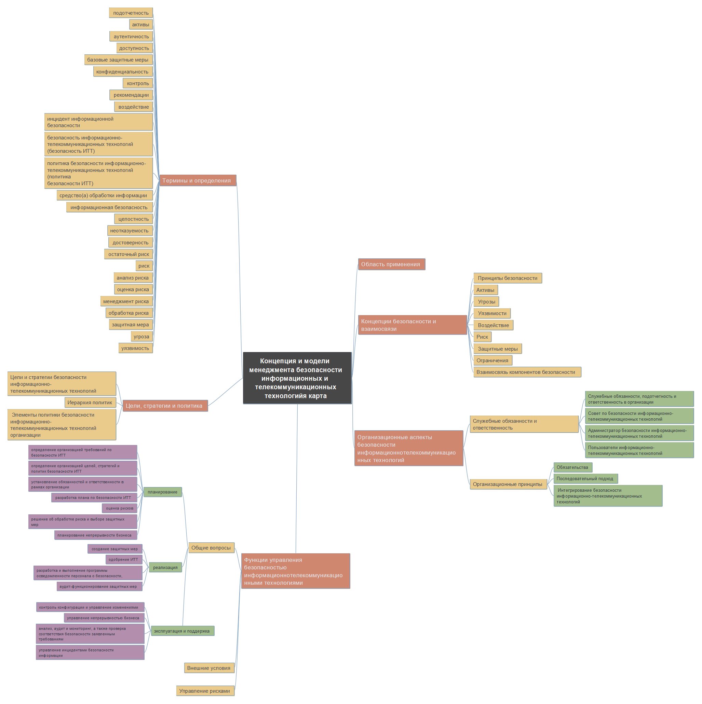

# Создание ментальной карты
Гуляев Степан БИСО-01-20

## Цель работы

1.  Изучить международные и российские стандарты, связанные с
    информационной безопасностью

2.  Получить навыки систематизации информации с помощью ментальной карты

## Исходные данные

1.  ОС Windows 10

2.  Freeplane

3.  ГОСТ Р ИСО/МЭК 13335-1-2006 «Информационная технология. Методы и
    средства обеспечения безопасности. Часть 1. Концепция и модели
    менеджмента безопасности информационных и телекоммуникационных
    технологий»

## Ход выполнения практической работы

С [веб-ресурса “Электронный фонд правовых и нормативно-технических
документов”](https://www.altell.ru/legislation/standards/) был скачан
текст стандарта ГОСТ Р ИСО/МЭК 13335-1-2006 «Информационная технология.
Методы и средства обеспечения безопасности. Часть 1. Концепция и модели
менеджмента безопасности информационных и телекоммуникационных
технологий»

Далее, с помощью программы Freeplane была создана ментальная карта:

## Оценка результата

В ходе выполнения практической работы была создана ментальная карта
(файл map.mm) по стандарту ГОСТ Р ИСО/МЭК 13335-1-2006 «Информационная
технология. Методы и средства обеспечения безопасности. Часть 1.
Концепция и модели менеджмента безопасности информационных и
телекоммуникационных технологий»

## Выводы

Таким образом, с помощью ментальной карты удалось систематизировать
информацию о стандарте в удобном для чтения виде.
